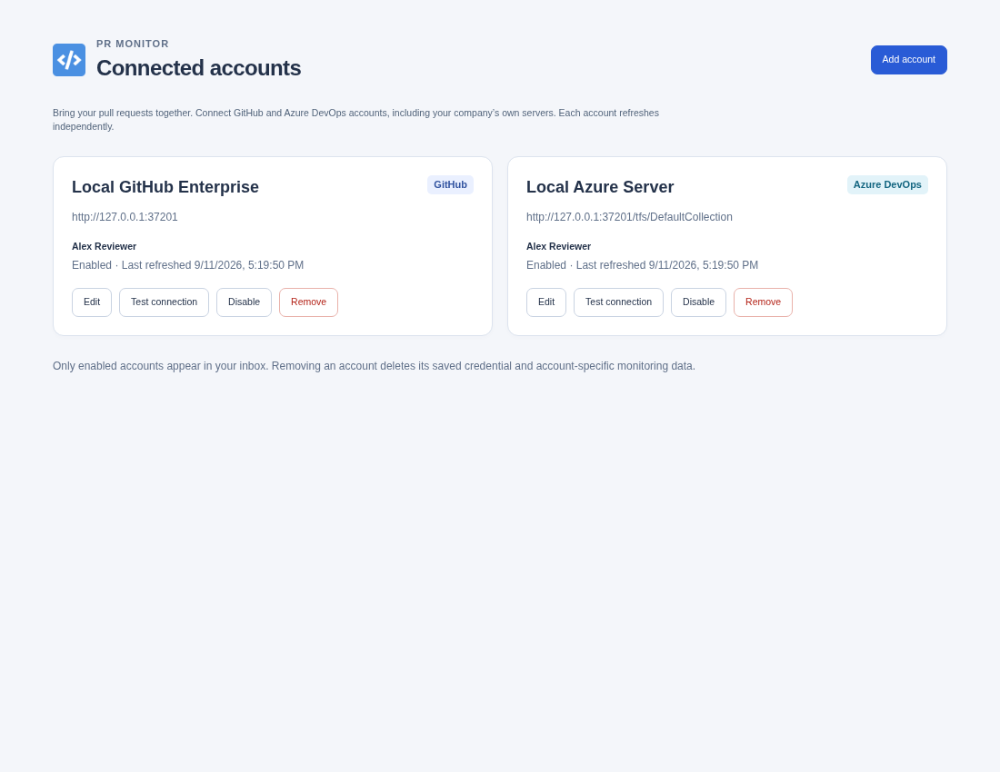
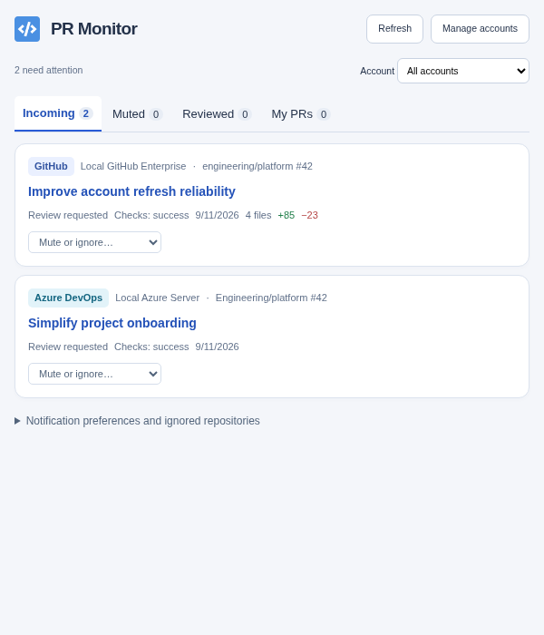
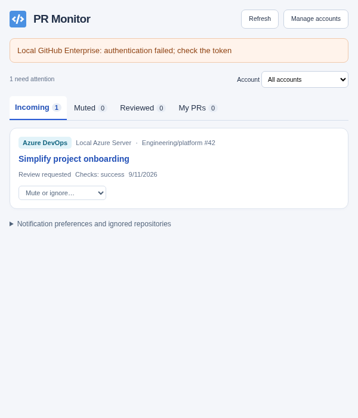

# Engineering revamp verification

Verified on September 11, 2026 with Node 22.20.0, pnpm 10.28.1, and Playwright 1.63.0 / bundled Chromium 153. The implementation requires Node 22.12 or newer.

## Result

`pnpm qa:autonomous` passed on the final implementation:

| Check                                                 | Result                            |
| ----------------------------------------------------- | --------------------------------- |
| Strict TypeScript, including tests                    | Passed                            |
| Oxlint                                                | Passed, no warnings               |
| Vitest unit and provider contract tests               | **123 passed** across 10 files    |
| Chromium real-extension tests                         | **11 passed**                     |
| Development fixture/UI tests                          | **11 passed**                     |
| Production extension build                            | Passed                            |
| Unexpected popup, options, or service-worker errors   | None observed                     |
| Frozen lockfile installation                          | Passed                            |
| Local release archive generation and entry validation | Passed                            |
| Live-provider smoke tests                             | **2 skipped**, credentials absent |
| Git diff whitespace validation                        | Passed                            |

The final complete browser run took approximately 14 seconds. The production Manifest V3 build was loaded without permanent host permissions. Provider tests used a temporary copy with access to a loopback HTTP fixture server, and verified real service-worker HTTP requests, storage, badges, and notification history. Test servers and browser profiles were cleaned up automatically.

The GitHub Actions workflows were updated to run these checks and package tag versions. A hosted Actions run was not triggered from this local workspace.

## Implementation

| Area                | Main files                                                                    | Behavior                                                                                                                                                                                   |
| ------------------- | ----------------------------------------------------------------------------- | ------------------------------------------------------------------------------------------------------------------------------------------------------------------------------------------ |
| Toolchain           | `package.json`, `pnpm-lock.yaml`, `vite.config.ts`, `tsconfig.json`           | pnpm, ESM, Vite, Vitest, Oxlint, strict TypeScript, React createRoot; obsolete Yarn/Webpack/Jest/ESLint tooling removed                                                                    |
| Account domain      | `src/accounts/model.ts`, `urls.ts`, `storage.ts`, `service.ts`                | Versioned account collection, normalized provider URLs, atomic migration, concurrent refresh, partial failure recovery, serialized storage mutations                                       |
| Credential boundary | `src/accounts/messages.ts`, `src/ui/Options.tsx`, `src/providers/http.ts`     | Background-only saved credentials, masked edit fields, preservation of unchanged tokens, user-triggered host requests, sanitized errors, no credentialed redirects                         |
| GitHub              | `src/github-api/implementation.ts`, `src/loading/`                            | GitHub.com and Enterprise endpoints, pagination, bounded PR fan-out, reviews/comments/commits, GraphQL checks with REST fallback, rate-limit and search-truncation errors                  |
| Azure               | `src/providers/azure.ts`                                                      | Services and Server collection paths, Basic PAT authentication, project continuation tokens, PR offset pagination, votes, threads, commits, status checks, partial project cache retention |
| Background          | `src/background.ts`, `src/accounts/notifications.ts`                          | MV3 worker, three-minute alarm, refresh messages, overlap prevention, account-scoped notification IDs and persisted click URLs                                                             |
| UI                  | `src/ui/`, `src/popup.tsx`, `src/options.tsx`                                 | Dedicated account manager, enabled/disabled state, removal confirmation, account filter, provider labels, warnings, familiar PR tabs and mute/preferences controls                         |
| Autonomous tests    | `src/testing/fixtures/`, `e2e/`, `playwright.config.ts`                       | Synthetic provider fixtures, local HTTP server, real extension startup/restart, deterministic UI scenarios, screenshots                                                                    |
| Delivery            | `.github/workflows/`, `scripts/package.mjs`, `README.md`, `PRIVACY_POLICY.md` | Corepack/pnpm CI, tag-version packaging, archive validation, provider setup, token scopes, privacy and troubleshooting documentation                                                       |

The legacy filtering tests remain covered; obsolete single-token Core tests were replaced by multi-account lifecycle tests.

## Coverage details

- GitHub.com, Enterprise, Azure Services, legacy Azure Services URLs, and Server URLs with ports and path prefixes.
- Two GitHub accounts, GitHub plus Enterprise, GitHub plus Azure, and two Azure organizations.
- Legacy raw/JSON token migration, cached PRs, mute rules, notification preferences/history, retries after storage failures, and restart safety.
- Add, edit, enable, disable, remove, and edits/removal during an in-flight refresh.
- Failed accounts retaining cache, total failures with and without cached data, offline state, denied host permission, and shared-origin cleanup.
- Identical PR coordinates scoped to different accounts; ignored repositories and notification keys do not collide.
- Azure project continuation tokens, PR offsets, partial project failures, vote mapping, and observed-vote baselines for later activity notifications.
- Persisted notification click routing after restart, cleared notification state on account removal, alarm-triggered refresh, and refresh-state updates in an already-open popup.
- Empty, populated, multiple-account, disabled, partial-failure, and 300-PR UI fixtures.
- Masked credentials, successful and failed connection testing, invalid URLs, permission rejection, and removal confirmation.

Browser verification found and fixed accessible form labels that included helper text. Final review also fixed a failed connection test being displayed with success styling. Additional regression checks cover stale refresh indicators and Azure votes without submission timestamps.

## Commands executed

The final validation used:

```sh
pnpm install --frozen-lockfile
pnpm qa:autonomous
pnpm package
pnpm test:live
git diff --check
```

`qa:autonomous` runs `pnpm typecheck`, `pnpm lint`, `pnpm test`, `pnpm build`, and `pnpm test:extension`; the latter rebuilds and runs Playwright. Installation/setup and focused repair checks also used:

```sh
pnpm install
pnpm exec playwright install chromium
pnpm typecheck
pnpm lint
pnpm test
pnpm build
pnpm test:e2e
pnpm test:e2e --grep 'adds an account|validates URLs'
```

Prettier formatted the changed TypeScript, React, CSS, configuration, workflow, and documentation files. Local server/browser launch and packaging required execution outside the restricted process sandbox. Those checks subsequently passed; no application defect remains attributed to that restriction.

The generated unpacked extension is in `dist/`. The locally validated development archive is `pr-monitor-0.0.0.zip`. No release was published.

## Screenshot evidence

All images contain synthetic fixture data only. Popup screenshots use a 600 × 700 viewport; options screenshots use 1100 × 850. Layouts were visually inspected.

- [Empty options page](screenshots/revamp/empty-options.png)
- [Empty popup](screenshots/revamp/empty-popup.png)
- [Connected GitHub Enterprise and Azure Server accounts](screenshots/revamp/multiple-accounts.png)
- [Populated popup](screenshots/revamp/populated-popup.png)
- [Partial provider failure with a usable Azure account](screenshots/revamp/partial-failure.png)







## Remaining verification and limitations

No live GitHub or Azure credentials were supplied. The opt-in live tests were skipped and no live-provider resources were accessed.

Native permission prompts and operating-system notification clicks require a manual smoke test. Permission derivation/rejection, service-worker notification creation/history, persisted click targets, and click-routing logic are covered automatically. To finish that environment-specific verification:

1. Load `dist/` from `chrome://extensions` and add an account for a server you control.
2. Confirm the browser asks only for the configured API host and that denying permission leaves the account unsaved.
3. Grant access, test the connection, and confirm a real PR appears. Repeat for the Enterprise/Server versions you deploy.
4. Confirm a desktop notification opens the intended provider PR and that browser/OS notification settings permit it.
5. Verify disable, edit with a blank token field, restart, and removal with your browser profile.

Azure Server support targets REST API 6.0 (Server 2020 and newer). Older Server versions and Firefox packaging are not verified. Azure status checks do not necessarily expose every branch-policy/build evaluation, and group-only review assignments may require Azure to expose the individual reviewer. These limits are documented in the README. OAuth and Microsoft Entra authentication remain outside this PAT-based implementation.

Credentials are stored in extension-local browser storage, not OS secret storage. HTTP self-hosted endpoints remain supported as requested and do not encrypt credentials in transit. The UI and privacy policy explain these risks.

## CI packaging follow-up

The first hosted CI run passed the autonomous checks but failed during packaging because `GITHUB_REF_NAME=main` was treated as a version. Packaging now takes a GitHub ref name only when `GITHUB_REF_TYPE=tag`; branch and pull-request builds use the manifest version, and `RELEASE_VERSION` remains an explicit override. Seven archive-level regression tests cover those cases, invalid tags, and rejection of test host permissions. They run as `pnpm test:package` and are included in `pnpm check` and `pnpm qa:autonomous`.

Automatic releases now follow successful main builds, using the tested build artifact and a serialized patch-version allocation. Release tests cover initial and numeric version selection, reruns after newer releases, browser version limits, packaging/upload failure, draft recovery, and completed-release idempotency. The old tag-only artifact workflow has been replaced by the CI release job.
